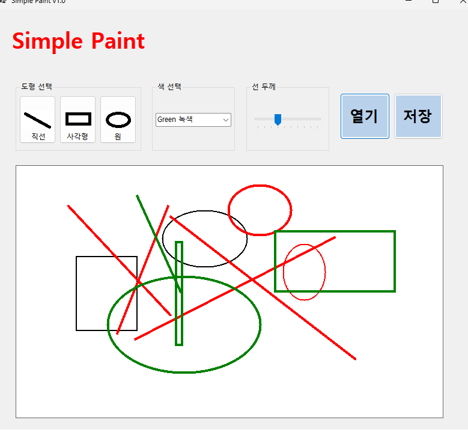
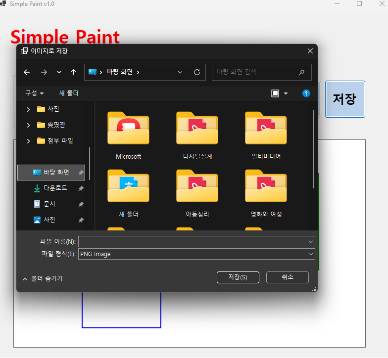
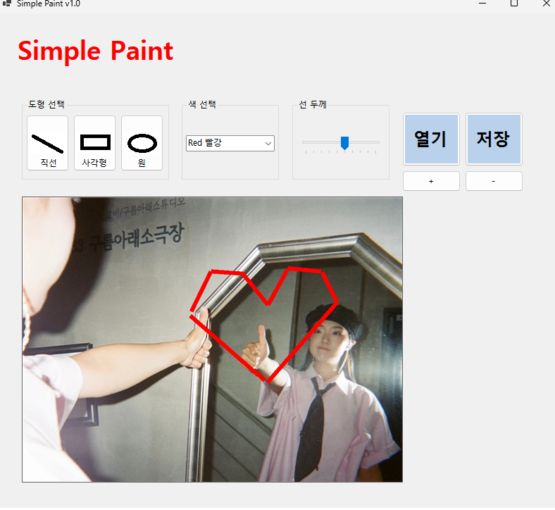

# SimplePaint
# (C# 코딩) 그림판

## 개요
-C# 프로그래밍학습

-1줄소개: 직선, 사각형, 원을 그릴 수 있는 그림판 프로그래밍

-사용한플랫폼: 

	-C#, .NET Windows Forms, Visual Studio, GitHub
-사용한컨트롤:

	-Label, Button, ComboBox, PictureBox, TrackBar
-사용한 기술과 구현한기능:

	-도형 그리기 : 직선, 사각형, 원을 그릴 수 있는 기능 구현

	-색상 선택 : 도형의 색상을 선택할 수 있는 기능 구현

	-선 굵기 조절 : 도형의 선 굵기를 조절할 수 있는 기능 구현

	-도형 선택 : 그려진 도형을 클릭하여 선택하는 기능 구현

	-미리보기 기능 : 도형을 그리기 전에 점선으로 미리 보여주는 기능 구현

	-파일 저장 : 완성된 이미지를 파일로 저장하는 기능 구현

	-파일 열기 : 이미지를 불러와 캔버스로 사용하여 그림을 그리는 기능 구현

	-확대 / 축소 : 이미지 확대 및 축소 기능 구현

	-이미지 크기 조절 : 스크롤바를 이용하여 이미지 크기를 조절하는 기능 구현

## 실행 화면 (과제1)
-코드의 실행 스크린샷과 구현 내용 설명

-구현한 내용 (위 그림 참조)

	-UI 구성 : 도형선택, 색선택, 선굵기 조절, 그리기 영역

	-도형 그리기 : 선택한 도형과 색상, 선굵기에 따라 그림판에 도형을 그리는 기능 구현

	-도형 선택 : 그려진 도형을 클릭하여 선택하는 기능 구현

	-색 선택 : 색상 선택 콤보박스를 통해 도형의 색상을 변경하는 기능 구현

	-선 굵기 조절 : 트랙바를 이용하여 도형의 선 굵기를 조절하는 기능 구현

## 실행 화면 (과제2)
-코드의 실행 스크린샷과 구현 내용 설명

-구현한 내용 (위 그림 참조)

	-기능 구현 : 도형 그리기 구현, 색상과 굵기 선택

	-도형 선택 : 그려진 도형을 클릭하여 선택하는 기능 구현

	-굵기 선택 : 트랙바를 이용하여 도형의 선 굵기를 조절하는 기능 구현

	-미리보기 기능 : 도형을 그리기 전에 점선으로 미리 보여주는 기능 구현

## 실행 화면 (과제3)
-코드의 실행 스크린샷과 구현 내용 설명

-구현한 내용 (위 그림 참조)
	
	-기능 구현 : 완성된 이미지를 파일로 저장하는 기능 구현

	-파일 저장을 위한 대화 상자인 SaveFileDialog 사용
	
	-3가지 포맷으로 저장 가능 (.bmp, .jpg, .png)

## 실행 화면 (과제4)
-코드의 실행 스크린샷과 구현 내용 설명

-구현한 내용 (위 그림 참조)
	
	-기능 구현 : 열기버튼을 통해 이미지를 불러 이를 캔버스로 사용하여 위에 그림을 그리도록 하는 기능 구현

	-확대 / 축소 기능 구현

	-이미지 크기 조절을 위한 스크롤바 기능 구현

	-이미지 크기에 맞춰 캔버스 크기 조정 
