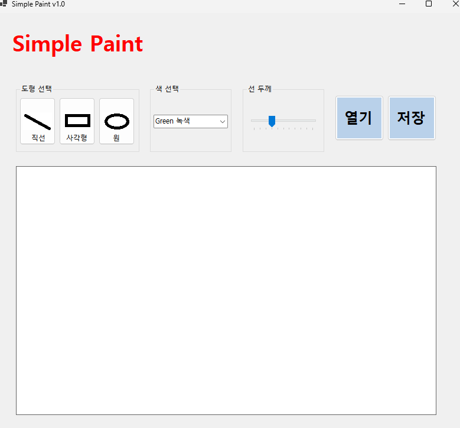

# SimplePaint
# (C# 코딩) 그림판

## 개요
-C# 프로그래밍학습
-1줄소개: 직선, 사각형, 원을 그릴 수 있는 그림판 프로그래밍

-사용한플랫폼: 
	-C#, .NET Windows Forms, Visual Studio, GitHub
-사용한컨트롤:
	-Label, Button, ComboBox, PictureBox, TrackBar
-사용한기술과구현한기능:

## 실행화면(과제1)
-코드의 실행 스크린샷과 구현 내용 설명

-구현한 내용 (위 그림 참조)

	-UI 구성 : 도형선택, 색선택, 선굵기 조절, 그리기 영역

	-도형 그리기 : 선택한 도형과 색상, 선굵기에 따라 그림판에 도형을 그리는 기능 구현

	-도형 선택 : 그려진 도형을 클릭하여 선택하는 기능 구현

	-색 선택 : 색상 선택 콤보박스를 통해 도형의 색상을 변경하는 기능 구현

	-선 굵기 조절 : 트랙바를 이용하여 도형의 선 굵기를 조절하는 기능 구현
